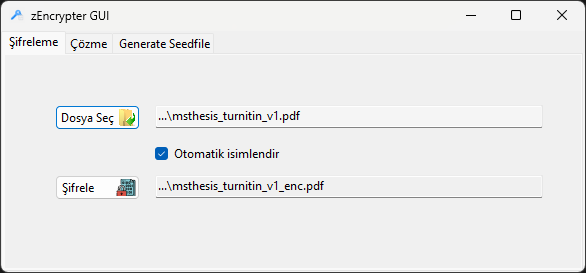
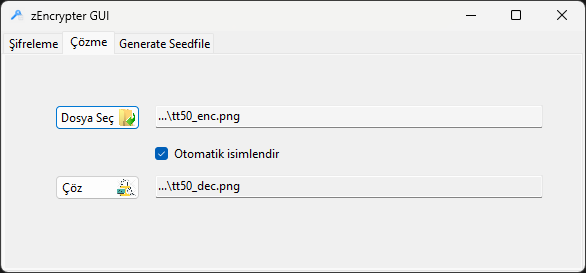
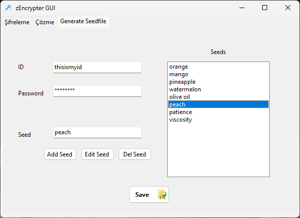
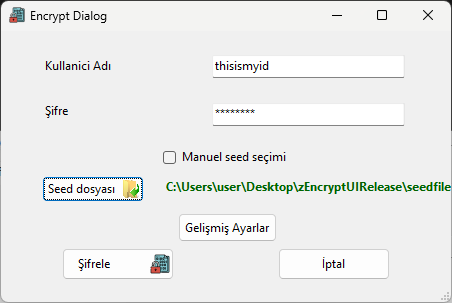
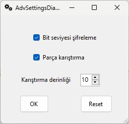

# zEncrypter
 
This software is an encrypt/decrypt engine with multiple layer of encryption using seeds and user authorization.  

# Now with a GUI!

 
Encypt screen 
 

 
Decypt screen 
 

 
Can generate and use 'seedfiles' for convinience 
 
 
 
 

# When building for the first time  
 
-> use bash scripts in scripts/ directory for convenience  
-> install cmake to build and run the app with ease  
-> you can also edit & use the scripts with the compiler of your choise  

# Using zEncrypter with a config file
Create a file named 'config.in' using the following options   
 
-> command = Command to run ( enc : encrypt, dec : decrypt )  
-> filepath = Relative path of the file to encrypt/decrypt  
-> fileout = Relative path of the output file   
-> id = Id of the encrypter   
-> pass = Password of the encrypter  
-> addseed = Add a seed  
-> mangling = Enable/disable mangling ( 0 : disable, 1 : enable )  
-> check = Enable/disable data loss check ( 0 : disable, 1 : enable )  
-> add '\#' at the beginning of a line to ignore the line  

# For manual use:
To encrypt a file  
 
-> use enc command  
-> enter id of encrypter and a password, this will be used to authenticate the decryption later.  
-> enter the path to the file  
-> enter a path for the encrypted output file  ( enter '.' to use default path )  
-> enter how many layers of encryption you want  
-> enter a seed for each encryption layer  
-> you are good to go  

To decrypt a file  

-> use dec command  
-> enter id and password of the encrypter. If you fail at this step, application will not let you decrypt.  
-> enter the path to the file  
-> enter a path for the decrypted output file  ( enter '.' to use default path )  
-> enter how many layers of encryption you want  
-> enter the seed for each decryption layer  

To find and print out differences between two files  

-> use pdif command  

To change the run settings ( Not implemented yet )  

-> use settings command  
