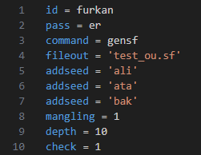
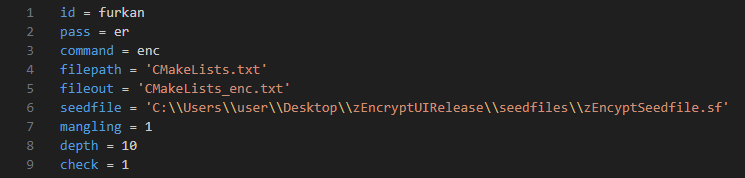

# zEncrypter
<br />
This software is an encrypt/decrypt engine with multiple layer of encryption using seeds and user authorization. <br />

# Now with a GUI!

<br />
Encypt screen<br />
<br />

<br />
Decypt screen<br />
<br />

<br />
Can generate and use 'seedfiles' for convinience<br />
<br />
<br />
Encyption dialog<br />
<br />
<br />
Advanced settings dialog<br />

# When building for the first time <br />
<br />
-> install cmake to build and run the app with ease <br />

```bash
#!/bin/bash
cd build ; cmake -DCMAKE_BUILD_TYPE=Release . ; cmake --build . --config Release    
```

-> use Visual Studio 2022 in the folder with .sln file to build and release the GUI <br />
```powershell
dotnet publish -c Release -r win-x64 --self-contained       
```


# Using zEncrypter in CLI with a config file
```bash
#!/bin/bash
zEncrypter.exe -c config.in
```
Create a file named 'config.in' using the following options  <br />
<p float="left">


</p>

-> command = Command to run <br />
-> available commands : enc : Encrypt, dec : Decrypt, pdif : Print differences of two files, gensf : Generate a seedfile, readsf : Read a seedfile <br />
-> filepath = Relative path of the file to encrypt/decrypt <br />
-> fileout = Relative path of the output file  <br />
-> id = Id of the encrypter  <br />
-> pass = Password of the encrypter <br />
-> seedfile = Set a seedfile to be used (You must be the owner!)<br />
-> addseed = Add a seed <br />
-> mangling = Enable/disable mangling ( 0 : disable, 1 : enable ) <br />
-> check = Enable/disable data loss check ( 0 : disable, 1 : enable ) <br />
-> add '\#' at the beginning of a line to ignore the line <br />
<br />
